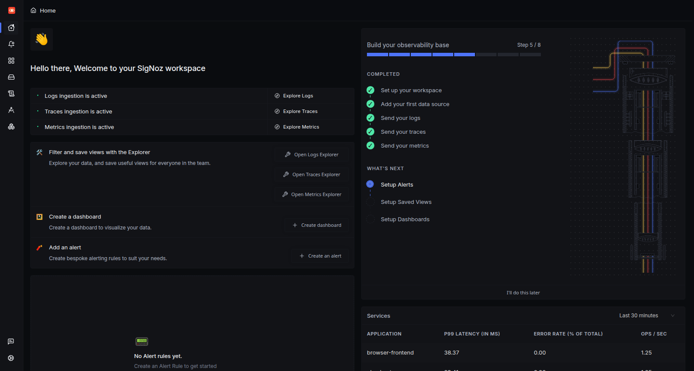
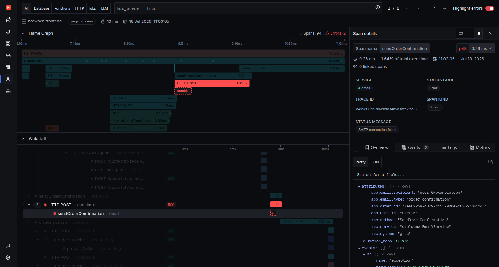
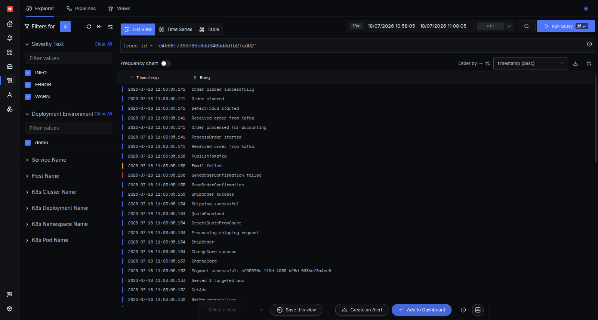
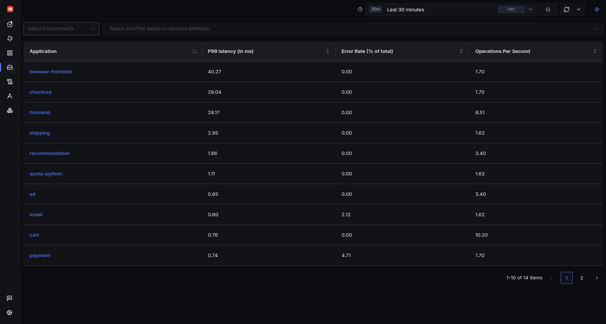

<!--
DEV.TO PUBLISHING CHECKLIST

1. Upload the four files in ./assets to DEV.to and replace the relative image paths
   with the URLs returned by DEV.to.
2. Re-read the article in your own voice and add your DEV.to profile/GitHub links.
3. Keep published:false until you are ready, or remove the front matter when pasting
   into the DEV.to editor.
4. The screenshots and observations below were collected from a local warm-up lab on
   18 July 2026. Re-run the final project workflow during the hackathon and publish a
   follow-up with the completed implementation.
-->

An alert tells me where a system is hurting. It does not always tell me where the failure began.

That difference is expensive during an incident. The loudest signal may come from an API gateway or checkout service, while the first locally abnormal operation sits several calls downstream. Engineers lose time moving between trace search, log search, metric charts, deployment context, and Slack—then reconstructing the same evidence for the next responder.

For the Agents of SigNoz hackathon, I want to build **RootSpan**: a read-only incident correlation agent that shortens that path. It will not patch code, restart production, or claim certainty it cannot prove. Its job is to find the first meaningful divergence between healthy and failing traffic, measure the blast radius, and give a human an evidence-linked handoff.

Before writing the agent, I built a local SigNoz lab and investigated a real failure manually. That gives the project a test oracle: if the agent cannot reproduce a careful human investigation, it should not recommend an action.

## The investigation contract

RootSpan should answer six questions in order:

1. Which service, operation, and time window are affected?
2. What do failing traces share that healthy traces do not?
3. Where does the error first appear with local evidence?
4. Which logs corroborate or contradict that trace-level hypothesis?
5. Is this one unusual request or a population-level incident?
6. What raw SigNoz evidence should the responder open next?

This is investigation, not autonomous remediation. A human remains responsible for deciding whether to roll back, change configuration, contact an owner, or continue observing.

## Building the local lab with Foundry

The hackathon requires SigNoz to be installed through Foundry. Foundry represents the deployment with `casting.yaml` and generates `casting.yaml.lock`, which makes the environment reproducible.

I used `foundryctl v0.2.14` and this local Docker configuration:

```yaml
apiVersion: v1alpha1
kind: Installation
metadata:
  name: signoz-warmup
spec:
  deployment:
    flavor: compose
    mode: docker
  mcp:
    spec:
      enabled: true
```

Then I ran:

```bash
foundryctl cast -f casting.yaml --no-updater
```

The cold image download was the slow part. Once the images were cached, the successful cast completed in about 15 seconds. The stack exposed the SigNoz UI on `localhost:8080`, OTLP ingestion on `4317` and `4318`, and the MCP endpoint on `localhost:8000/mcp`.

One setup detail was easy to miss: before the first workspace was registered, the collector accepted a placeholder configuration. Registration triggered an OpAMP configuration update that activated the real trace, metric, and log pipelines. If OTLP appears reachable but no data arrives, finish the workspace setup and inspect the collector configuration rather than immediately blaming the application instrumentation.



## Sending telemetry worth correlating

For the warm-up I used the official [OpenTelemetry Demo Lite](https://github.com/SigNoz/opentelemetry-demo-lite), configured for two requests per second. It produces traces, metrics, and logs from 14 services across Go, JavaScript, and Python:

`accounting`, `ad`, `browser-frontend`, `cart`, `checkout`, `currency`, `email`, `fraud-detection`, `frontend`, `payment`, `product-catalog`, `quote-python`, `recommendation`, and `shipping`.

The demo also generates controlled failures. The payment service rejects about 5% of calls, while the email service simulates an SMTP failure on about 2%. That is useful for correlation because successful and failing cohorts exist at the same time under the same deployment.

This reinforced a basic observability lesson: an agent cannot recover structure the telemetry never recorded. Stable `service.name` and operation names, propagated trace context, error status, and trace-aware logs are more valuable than clever prompting.

## Following a failure through the trace

I filtered for traces containing errors and selected a representative trace:

```text
d4998f7399786e8dd3405d3dfb2fcd62
```

It crossed all 14 services and contained 94 spans. The visible transaction lasted about 16 ms, so this was not primarily a latency investigation.

The waterfall showed two red spans around order confirmation. The `email` service's server span, `sendOrderConfirmation`, carried the first clear local evidence:

- status: `Error`;
- message: `SMTP connection failed`;
- exception event recorded on the email span;
- a second `email_failed` event with `smtp_error` as the failure reason.

Its checkout ancestor also returned an error, but the email span contained the local exception. That distinction is exactly what RootSpan must preserve: an upstream error is not automatically the origin of the failure.



I would describe this as the **first locally evidenced failure**, not an absolute root cause. The SMTP dependency itself is not instrumented, so the trace cannot prove why the connection failed.

## Correlating the logs without a time-window guessing game

The selected email span did not have a log record attached directly to its span ID. SigNoz still let me pivot from the trace to all logs carrying the same trace ID.

That view showed the sequence clearly:

```text
SendOrderConfirmation
SendOrderConfirmation failed
Email failed
PublishToKafka
Order placed successfully
```

This is more informative than searching globally for “SMTP”. The error is real, but the order workflow continued. Accounting and fraud-detection consumed the order, and checkout logged `Order placed successfully`.

That evidence changes the incident classification. The likely customer impact is a missing confirmation email, not a failed order. A responder might contact the email-service owner or inspect the SMTP dependency instead of rolling back the entire checkout service.



There is also a useful contradiction here: the failing trace contains a successful business outcome. RootSpan should include contradictory evidence in its handoff rather than hiding it to make a cleaner story.

## Checking population-level impact

One trace is evidence; it is not an incident by itself.

In the 30-minute service view captured below, SigNoz showed all 14 applications with latency, error-rate, and throughput columns. Email had a 2.12% error rate with 0.80 ms p99 latency. Payment showed a 4.71% error rate with 0.74 ms p99 latency. The rates matched the demo's controlled failure behavior closely enough to confirm that the trace was part of a recurring population, not a single corrupt sample.



This is still not a healthy-versus-incident comparison. A production-quality agent must compare explicit cohorts and retain counts as well as percentages. A 5% error rate across 20 requests is not equivalent to 5% across 20 million.

## What the agent should automate

The manual warm-up exposed the mechanical work that an MCP-driven agent can remove:

- query a bounded set of failing and healthy traces;
- group failures by service and operation;
- reconstruct the full parent-child trace rather than stopping at the matching span;
- rank the first locally abnormal spans;
- fetch logs by trace and span context;
- check service-level error, latency, and throughput signals;
- return direct evidence links, timestamps, query arguments, and confidence reasons.

The agent's output should look less like a chatbot answer and more like an incident handoff:

```text
Hypothesis: email confirmation is degraded after checkout succeeds
First local evidence: email/sendOrderConfirmation
Trace evidence: SMTP exception; checkout ancestor propagated the error
Corroborating logs: SendOrderConfirmation failed; Email failed
Contradictory evidence: order published and placed successfully
Observed impact: recurring email failures; order path continues
Next human checks: SMTP dependency health, email service changes, affected users
```

Every line should be clickable back to SigNoz or reproducible from a stored query. If the agent cannot show its evidence, it should lower its confidence instead of becoming more persuasive.

## Why I am not starting with auto-remediation

Most teams will not allow a new AI agent to edit code or restart production during a live incident—and they should not have to.

The first valuable product is smaller and safer: reduce the time between alert and the first correct human decision. A read-only correlator has a realistic adoption path because responders can verify every claim, learn where the model is weak, and measure whether it actually reduces triage time.

Telemetry correlation is also not causality. A span may wait on an uninstrumented dependency. A deployment may be near an alert but unrelated. A “healthy” baseline may contain a different traffic mix. Human judgment is still required to test the hypothesis and choose a production action.

## What I will build during the hackathon

The implementation will be intentionally narrow:

1. A Python correlation engine that queries SigNoz through MCP and compares healthy and failing trace cohorts.
2. A deterministic scoring layer for local errors, cohort specificity, corroborating logs, blast radius, and contradictory evidence.
3. A small React investigation console that presents hypotheses and deep links, not a fake autonomous command center.
4. A Go incident lab that produces one repeatable multi-service failure for the demo.
5. An evidence ledger in SQLite so every conclusion records the query, time window, and source IDs that produced it.

The success metric is not “the model fixed production.” It is whether another engineer can reach and verify the right next action faster.

## Conclusion

The warm-up trace already demonstrated why correlation matters. A red checkout span suggested a failed purchase. The deeper email exception and trace-linked logs showed a narrower reality: confirmation failed, while the order continued successfully.

That is the kind of distinction I want RootSpan to surface consistently. SigNoz already holds the evidence across traces, logs, and service metrics. The agent's job is to assemble it into a bounded, honest handoff—then let the human decide what to do.

## References

- [Agents of SigNoz hackathon](https://www.wemakedevs.org/hackathons/signoz)
- [SigNoz Foundry installation guide](https://signoz.io/docs/install/docker/)
- [SigNoz MCP server](https://github.com/SigNoz/signoz-mcp-server)
- [OpenTelemetry Demo Lite](https://github.com/SigNoz/opentelemetry-demo-lite)
- [SigNoz Query Builder v5](https://signoz.io/docs/userguide/query-builder-v5/)
- [OpenTelemetry log correlation](https://opentelemetry.io/docs/specs/otel/logs/)

<!--
AI DISCLOSURE
This article was drafted and edited with assistance from OpenAI Codex. The author
personally verified the commands, screenshots, measurements, and conclusions in the
local SigNoz lab. Adapt this disclosure if the submission form requests it.
-->
