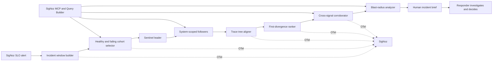

# RootSpan: project strategy

## Product thesis

Companies do not need another agent that confidently proposes a production change. During an incident, responders first need a reliable answer to four questions:

1. Where did behavior first diverge from healthy traffic?
2. Which evidence supports or contradicts that conclusion?
3. What is the actual customer and SLO impact?
4. What should the human inspect next?

RootSpan is a read-only investigation system that answers those questions from SigNoz telemetry. It reduces MTTI and MTTR, which protects the service’s SLO and external SLA, without asking a company to delegate operational authority to a model.

## One-line pitch

RootSpan coordinates read-only system sentinels, compares healthy and failing trace cohorts, locates the first shared cross-signal divergence, and hands the responder a cited incident brief in seconds.

## Why this is more specific than an SRE copilot

RootSpan is not:

- a chatbot over logs;
- an alert summarizer;
- a generic root-cause claim from one trace;
- a remediation agent;
- a recent-deployment list with an LLM explanation.

Its technical centerpiece is **cohort-based first-divergence analysis**. It identifies the earliest anomalous operation common across multiple failing traces, then requires corroboration from logs, metrics, or change events. The agent explains and guides; deterministic analysis establishes the evidence.

## Golden incident

### Instrumented system

`traffic generator → gateway → checkout → inventory → database`

Each service emits OpenTelemetry traces, trace-correlated structured logs, RED metrics, and attributes such as service version, region, feature-flag variant, and customer tier.

### Failure

The `inventory-v2` cohort develops a timeout. The user-visible alert fires on the gateway/checkout SLO, so the loudest service is not the source. Only one region and feature-flag cohort are affected.

### RootSpan result

The incident brief shows:

- `inventory.reserve` as the earliest shared divergence across failing traces;
- healthy versus failing latency/status distributions at that span;
- a newly frequent inventory timeout log fingerprint;
- the exact version/region/flag cohort affected;
- the flag change occurring shortly before the SLO burn began;
- unaffected traffic as contradicting/boundary evidence;
- links to every supporting SigNoz query and representative trace;
- an owner/runbook handoff for the human responder.

RootSpan labels this a ranked hypothesis, not incontrovertible root cause.

### Failure-testing boundary

The current incident lab uses a deterministic, scoped fault injector to create the golden timeout scenario. Traffic volume is bounded, the switch is resettable, and the smoke gate asserts recovery. That is controlled fault injection, not a claim that RootSpan is a chaos-engineering platform. A true chaos layer would additionally require explicit steady-state hypotheses, safety aborts, experiment scheduling, broader fault types, and persisted experiment outcomes.

### Sentinel Mesh

Every live incident creates an incident-scoped leader/follower mesh rather than one global agent. Gateway, checkout, inventory, and database sentinels observe only their attached system scope. The elected leader delegates their bounded work in parallel, compiles the returned evidence inputs, and hands them to the deterministic ranker.

Leadership is a SQLite lease, not a model decision or an agent vote. An active lease is stable; expiry or a failed leader advances the generation and selects the next healthy sentinel. Follower failure degrades the mesh visibly without discarding other findings. If every sentinel fails, the investigation stops safely and the incident state records `FAILED`.

The shipped sentinel policy is an autonomous deterministic expert policy. A later provider adapter may plan among the same schema-limited read-only observations, but it cannot alter evidence, scoring, leadership, or the human approval boundary.

## Investigation pipeline

### 1. Detect meaningful impact

Use SigNoz multi-window SLO/error-budget alerts rather than inventing a new anomaly detector. The alert provides:

- affected service and operation;
- SLO and burn rate;
- trigger time `t0`;
- incident window and severity.

Detection is anchored to user impact, not raw log volume.

### 2. Select comparable cohorts

Build two cohorts for the affected operation:

- **incident cohort:** error or high-latency traces near `t0`;
- **healthy cohort:** successful traces from a nearby healthy window, matched on route and important dimensions.

Matching dimensions may include service version, region, customer tier, and flag variant. If a useful healthy cohort cannot be found, RootSpan must say so rather than manufacture a comparison.

### 3. Normalize and align trace trees

Represent each trace as an ordered service/operation tree. Ignore volatile values and retain comparison features such as:

- service and span name;
- parent/child topology;
- duration distribution;
- status/error type;
- selected stable attributes;
- downstream peer or database system.

Align equivalent healthy and failing paths and identify the earliest node at which their behavior separates.

### 4. Rank divergence candidates

Candidate ranking combines:

- prevalence across failing traces;
- rarity in matched healthy traces;
- anomaly magnitude in latency/error status;
- temporal precedence before upstream failures;
- location in the service topology;
- independent support from logs, metrics, and change events;
- penalties for contradictory evidence or weak cohort coverage.

Keep the scoring transparent. The UI should show why a candidate ranked first and what could invalidate it.

### 5. Corroborate across signals

- **Logs:** template/fingerprint frequency shift, new errors, and trace-linked examples.
- **Metrics:** rate, error, duration, saturation, and business KPI changes.
- **Changes:** deployment version, feature-flag events, configuration changes, or dependency state.
- **Topology:** whether the candidate is upstream of the observed cascade.

No high-confidence conclusion should rest only on semantic similarity or an LLM judgment.

### 6. Calculate blast radius

Group the affected cohort by available dimensions and report both numerator and denominator:

- route/operation;
- service version;
- region/zone;
- feature-flag variant;
- customer tier or tenant where safe;
- request volume and error-budget burn.

This tells the responder whether the incident is global, isolated, or still expanding.

### 7. Compile the human handoff

The output is an incident packet, not prose alone:

- concise situation summary;
- ranked divergence candidates;
- evidence and contradiction table;
- impact/blast-radius table;
- event timeline;
- deep links to SigNoz queries and traces;
- exact next queries;
- responsible team/runbook metadata;
- machine-readable JSON for incident-management integrations.

## Architecture

## Product screen

One screen should answer the responder’s questions without duplicating SigNoz:

- **top:** SLO burn, scope, elapsed time, and confidence;
- **left:** service cascade with the first divergence highlighted;
- **center:** healthy/failing trace cohort diff;
- **right:** ranked evidence and contradictions;
- **bottom:** blast radius, event timeline, exact next queries, and handoff/export;
- **every claim:** a deep link back to raw SigNoz evidence.

## Agent boundary

Deterministic code owns:

- leader leases, failover, bounded delegation, and agent outcome recording;
- cohort construction;
- trace alignment;
- divergence scoring;
- log/metric frequency calculations;
- blast-radius aggregation;
- evidence IDs and query provenance.

The model may:

- choose among bounded read-only investigation tools;
- summarize already computed evidence;
- explain competing hypotheses;
- propose the next read-only query;
- translate the packet for different responder roles.

The model may not:

- elect a leader or decide whether evidence exists;
- execute shell, infrastructure, deployment, or code tools;
- invent evidence not present in the evidence store;
- label a candidate as certain when coverage/confidence is weak;
- hide contradicting evidence.

## SigNoz depth

RootSpan uses SigNoz as:

1. the SLO/alert source;
2. the traces, logs, and metrics evidence store;
3. the MCP investigation interface;
4. the Query Builder surface for exact/reproducible queries;
5. the dashboard for incident and agent performance;
6. the observability backend for RootSpan itself.

Suggested RootSpan spans:

- `incident.window.build`
- `cohort.select`
- `sentinel.leader.elect`
- `sentinel.delegate`
- `sentinel.observe`
- `sentinel.leader.failover`
- `signoz.query`
- `trace.align`
- `divergence.rank`
- `logs.fingerprint.compare`
- `metrics.change.compare`
- `blast_radius.calculate`
- `hypothesis.explain`
- `brief.compile`

## Success metrics

Measure honestly during the sprint:

- alert-to-brief latency;
- time to identify the correct service/operation;
- query count saved versus a documented manual investigation;
- trace cohort coverage;
- precision of the top-ranked divergence across seeded incidents;
- percentage of claims with clickable evidence;
- abstention rate when evidence is insufficient;
- agent token/tool-call latency and cost.
- sentinel availability, degraded runs, lease generations, and leader failovers.

Do not promise SLA improvement from a synthetic demo. Show measured reductions in investigation steps/time and explain how those reduce MTTI/MTTR.

## Scope

### Must ship

- one deterministic incident with a misleading upstream alert;
- SigNoz SLO alert and cross-signal telemetry;
- matched healthy/failing trace cohorts;
- first-divergence ranking across multiple traces;
- log and metric corroboration;
- blast-radius segmentation;
- cited incident brief and SigNoz deep links;
- RootSpan’s own traces, metrics, dashboard, and alerts;
- replay fixtures and reproducible Foundry setup.

### Strong stretch goal

A second seeded incident where evidence is insufficient or contradictory and RootSpan correctly lowers confidence/abstains.

### Non-goals

- autonomous remediation;
- arbitrary repository or infrastructure access;
- general-purpose chat;
- custom ML anomaly detection;
- many shallow incident types;
- replacing SigNoz’s existing exploration UI.
