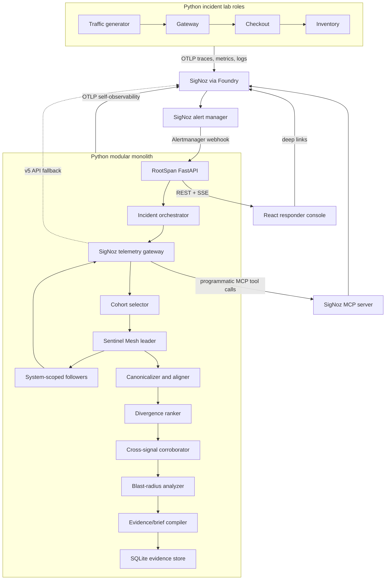

# RootSpan stack and architecture

## Decision

Use a small two-language stack:

- **Python 3.13** for the RootSpan API, SigNoz MCP client, correlation engine, evidence model, deterministic incident-lab roles, traffic generator, and optional read-only AI narrator.
- **TypeScript + React** for the responder console.
- **SigNoz + SigNoz MCP through Foundry** for telemetry storage, alerts, Query Builder, dashboards, and read-only investigation tools.
- **SQLite** for RootSpan incident state and evidence provenance.

This is not a microservice architecture. RootSpan is one modular Python package with separate API and incident-lab entry points plus one static web application. Compose runs the role-configured lab entry point as gateway, checkout, inventory, and traffic-generator processes so distributed traces remain realistic without a second backend toolchain.

## Why this stack

| Option | Strength | Cost | Decision |
| --- | --- | --- | --- |
| Python backend/lab + React | Fastest credible build, one backend toolchain, shared OTel/config/test helpers | Less polyglot novelty | **Selected** |
| Python backend/lab + server-rendered UI | Fewest tools and fastest first screen | Higher risk for the interactive service graph and aligned-trace UX | Reject for UX risk |
| Python core + Go lab + React | Realistic typed polyglot telemetry | Duplicate service, OTel, build, and test setup | Reject for sprint speed |
| TypeScript backend/lab + React | One language across the product | Slower numerical/evidence work and weaker fit with the selected MCP/data tooling | Reject |
| Add Rust/Java/Kotlin | Interesting engineering | Learning and integration cost with no demo advantage | Reject |

Python performance is sufficient because an incident run analyzes a deliberately bounded cohort, not the full telemetry store. SigNoz performs filtering and aggregation; RootSpan handles tens of complete traces, evidence records, and group summaries.

### Back-of-the-envelope delivery estimate

Assumptions: one contributor, one golden incident, existing product plan, a custom React screen, and no time counted for optional agent narration.

| Workstream | Python lab | Go lab |
| --- | ---: | ---: |
| Foundry, SigNoz, and repository bootstrap | 5 h | 5 h |
| Incident services, traffic, and failure control | 6 h | 9 h |
| OTel traces, metrics, logs, and correlation fields | 6 h | 8 h |
| Correlation API and evidence pipeline | 15 h | 15 h |
| React responder console | 8 h | 8 h |
| Integration, tests, replay, and demo hardening | 8 h | 8 h |
| Cross-toolchain overhead | 0 h | 2 h |
| **Expected total** | **48 h** | **55 h** |

The estimate is intentionally coarse (roughly ±25%). The approximately seven-hour saving is large enough to fund replay mode, evidence provenance, or demo hardening, all of which score better than a second implementation language by itself.

## Selected libraries

### Implementation checkpoint — July 26, 2026

The fixture/replay and live vertical slices are implemented: deterministic correlation core, MCP/Query Builder gateway, alert webhook, persisted state machine, incident-scoped Sentinel Mesh, SSE progress, SQLite briefs, responder console, instrumented incident lab, Compose package, and live SigNoz traces/logs/metrics. The optional narrator and direct-HTTP fallback remain non-critical future adapters.

### RootSpan backend

- FastAPI and Uvicorn: versioned replay/live APIs, alert webhook, and SSE progress.
- Pydantic v2: external and internal typed contracts.
- httpx: bounded incident-lab calls, traffic/smoke checks, and SigNoz bootstrap.
- MCP Python SDK v1: read-only Streamable HTTP calls to SigNoz MCP.
- Python standard-library `statistics` and interval logic: current bounded-cohort comparisons.
- Standard-library `sqlite3` + SQLite: immutable compiled incident briefs.
- OpenTelemetry Python SDK/exporters plus FastAPI/httpx instrumentation.
- pytest: deterministic unit, functional, API, persistence, and abstention tests.
- Ruff and Pyright strict mode for quality gates.
- uv: Python runtime/dependency management and reproducible lockfile.

The MCP SDK and Query Builder v5 execution path are implemented and locked. Add another data adapter only when a measured transport limitation requires it.

Do not begin with pandas, SciPy, NetworkX, Celery, Redis, Kafka, PostgreSQL, a graph database, or a vector database. Add a dependency only when a measured need appears.

### Incident lab

- FastAPI/HTTPX with shared OpenTelemetry Python SDK, OTLP exporters, and instrumentation.
- Structured JSON logs enriched with trace/span IDs; OTLP traces, logs, and metrics are live.
- One role-configured entry point selected by `SERVICE_ROLE` for gateway, checkout, inventory, and traffic-generator processes.
- Shared Pydantic configuration and scenario contracts, with isolated state per process.
- pytest contract tests for handlers, propagation, failure control, and reset behavior.

Use OTLP for traces, metrics, and logs. The lab still emits structured JSON bodies so event names and trace/span correlation remain deterministic after OTLP export.

### Responder console

- React + TypeScript + Vite.
- pnpm with a lockfile.
- TanStack Query for API state.
- Recharts for bounded, evidence-derived candidate, cohort, evidence-mix, duration, and blast-radius plots.
- CSS-native service cascade, evidence ledger, incident picker, workspace pagination, and timeline.
- Vitest for component logic plus production-proxy desktop/mobile browser smoke checks.

The API exposes both persisted progress snapshots and SSE. The console remains a custom responder surface and does not carry React Flow, ECharts, or a generic dashboard framework. Every plotted value is derived from the persisted incident brief; a time-series chart must remain absent until the domain and gateway contracts expose verified metric samples.

Use a custom visual system with one incident workspace paginated into Overview, Telemetry, Evidence, and Handoff. Do not spend the sprint assembling a generic dashboard framework.

### AI layer

Start without an agent framework. Use a thin interface such as:

```text
Narrator.compile(evidence_bundle) -> IncidentNarrative
Narrator.propose_next_query(incident_state) -> BoundedReadQuery
```

The model receives evidence IDs and structured summaries, not an unbounded dump of telemetry. Its tools are read-only and schema-limited. Use the chosen model provider's official SDK with structured output. Add a provider adapter only after the deterministic incident brief works.

Do not start with LangGraph, LangChain, CrewAI, or an autonomous tool loop. RootSpan has a known workflow and does not need durable agent orchestration. Every important state transition belongs to RootSpan's explicit incident state machine and OTel trace.

## System architecture



## Live runtime flow

1. The bootstrapped SigNoz trace-based checkout error-rate alert calls `POST /api/v1/webhooks/signoz` with an Alertmanager-compatible payload.
2. RootSpan deduplicates updates using the alert fingerprint and creates an incident state record.
3. The window builder bounds the query from `startsAt` and the configured maximum lookback; healthy and failing cohorts are selected from that same comparable window.
4. An atomic SQLite lease elects one incident leader. It delegates bounded observations to gateway, checkout, inventory, and database sentinels with a maximum concurrency of four.
5. The sentinels use the SigNoz gateway to call MCP tools programmatically:
   - `signoz_search_traces` for candidate failing and healthy traces;
   - `signoz_get_trace_details` for bounded complete trace retrieval;
   - `signoz_search_logs` for timeout and change-event evidence;
   - `signoz_execute_builder_query` for trace-latency and blast-radius aggregations;
   - `signoz_query_metrics` through the typed gateway when a bounded follow-up metric is requested.
6. Complete-trace requests run with bounded concurrency and explicit transport timeouts. Evidence-producing results store the tool name, typed arguments, time range, response hash, observation time, and deep link. Per-call latency/status persistence and retry/backoff remain future hardening.
7. A failed follower is recorded as degraded. A failed leader transfers its lease to a healthy follower; total mesh failure stops the investigation safely.
8. The deterministic correlation pipeline produces ranked candidates and evidence grades.
9. A future optional model may turn the evidence bundle into concise prose and bounded next-query suggestions; it is not part of the current runtime path.
10. The API streams stage changes to the console over SSE, and the responder follows deep links into SigNoz.

The SigNoz MCP tools already expose structured trace search, full trace detail, log search, aggregation, Query Builder v5, and UI deep links. RootSpan should invoke those tools as a normal MCP client; an LLM is not required to call them.

## SigNoz gateway boundary

All SigNoz access sits behind one Python protocol:

```text
TelemetryGateway
  search_trace_ids(query) -> tuple[TraceRef, ...]
  get_trace(trace_id, window) -> TraceGraph
  search_logs(query) -> tuple[LogRecord, ...]
  aggregate(signal_query) -> AggregateResult
  query_metrics(query) -> MetricSeries
```

Implementations:

1. `McpSigNozGateway` — primary hackathon adapter using stable MCP Python SDK v1.x over Streamable HTTP.
2. `FixtureTelemetryGateway` — deterministic replay and contract tests.

Direct Query Builder v5 execution is encapsulated inside the MCP adapter. A separate direct-HTTP adapter remains only a fallback if the MCP transport becomes unavailable.

The core correlation packages must import the protocol and domain types, never MCP or HTTP response types.

## Incident state machine

```text
RECEIVED
  -> COLLECTING
  -> COHORTING
  -> ALIGNING
  -> CORROBORATING
  -> COMPILING
  -> READY

Any stage -> INSUFFICIENT_EVIDENCE
Any stage -> FAILED
Resolved webhook -> CLOSED
```

Persist each transition before moving forward. The complete ordered history remains inspectable after a restart; automatic requeue/resume of a non-terminal incident is future work. This provides an auditable lifecycle without adding Celery or Temporal.

## Core domain contracts

```text
Incident
  id, alert_fingerprint, state, started_at, target_operation,
  incident_window, baseline_window, labels, slo_context

TraceGraph
  trace_id, root_operation, dimensions, nodes, edges, web_url

SpanNode
  span_id, parent_span_id, operation_key, service, name, kind,
  start_ns, end_ns, inclusive_ns, exclusive_ns, status,
  error_type, stable_attributes

Cohort
  failing_trace_ids, healthy_trace_ids, match_dimensions,
  requested_size, usable_size, coverage, exclusions

DivergenceCandidate
  operation_key, failing_prevalence, healthy_prevalence,
  duration_shift, error_lift, local_attribution,
  supporting_evidence_ids, contradicting_evidence_ids,
  score, evidence_grade

Evidence
  id, signal, query_tool, query_args, response_hash,
  observation, observed_at, web_url

IncidentBrief
  situation, impact, ranked_candidates, timeline,
  blast_radius, next_queries, evidence_index, sentinel_mesh

SentinelMeshRun
  leader_id, previous_leader_ids, follower_ids, status,
  lease_generation, started_at, completed_at, findings

SentinelFinding
  sentinel_id, system, role, outcome, summary,
  evidence_ids, started_at, completed_at, error_code
```

Use these contracts for API responses, SQLite JSON payloads, fixtures, and tests so the live and replay paths cannot drift.

## Correlation algorithm

### 1. Canonical operation identity

Build a stable key from:

```text
service.name | span.name | span.kind | peer.service-or-db.system
```

Do not include trace IDs, span IDs, pod IDs, timestamps, raw URLs, or other high-cardinality values.

### 2. Cohort matching

- Start with approximately 20–50 failing traces and the same number of healthy traces.
- Require the same root operation.
- Prefer the same service topology/path signature.
- Match important dimensions such as region and version, while deliberately allowing the suspected dimension (for example flag variant) to differ when measuring its blast radius.
- Record why each trace was included or excluded.
- Mark the run insufficient when usable coverage falls below a configured threshold.

### 3. Attribution-aware trace alignment

A naive root-to-leaf scan would rank the gateway because its duration includes the downstream delay. RootSpan must distinguish local failure from propagated symptoms:

- align nodes by canonical operation identity and parent path;
- calculate exclusive/self duration by subtracting child interval unions;
- distinguish a span's local error/exception evidence from an ancestor status propagated from a child;
- penalize a parent candidate when its anomaly is explained by an anomalous child;
- prefer the deepest locally anomalous node that appears consistently across failing traces.

In the demo, “first divergence” means the earliest **causal/local** divergence that explains the upstream cascade, not the span with the earliest start timestamp.

### 4. Robust comparisons

Use explainable features:

- failing prevalence minus healthy prevalence;
- error-rate lift;
- median inclusive-duration ratio;
- median exclusive-duration ratio;
- robust deviation using median and MAD when sample size permits;
- topology/local-attribution factor;
- independent log/metric/change-event support;
- contradiction and low-coverage penalties.

Expose each feature separately. Call the result an evidence score/grade, not a calibrated probability unless calibration is actually implemented.

### 5. Log fingerprints

Prefer structured `event.name`, `exception.type`, and stable attributes in the incident lab. For unstructured bodies, begin with a small deterministic normalizer that masks timestamps, UUIDs, IPs, numbers, and IDs. Drain3 can be an optional later adapter, but its last published release is old enough that it should not be a Day 1 dependency.

### 6. Blast radius

Ask SigNoz to aggregate both affected and total requests by bounded dimensions, then compute counts and percentages. Do not download all spans merely to group them in Python.

## Persistence model

The MVP stores an immutable `IncidentBrief` JSON document in one `incident_briefs` table keyed by incident ID, with completion time and state indexed in columns. This is sufficient for replay, listing, and restart persistence without an ORM.

Live multi-stage collection uses:

- `incidents`
- `stage_runs`
- `incident_briefs`
- `sentinel_leases`

Evidence, candidates, and the completed Sentinel Mesh report are stored inside the immutable validated brief. Stage transitions are normalized for ordered progress, while `sentinel_leases` stores only incident ownership, generation, and expiry. Query payloads, selected observations, response hashes, and deep links are retained without duplicating raw telemetry.

## Deployment

Use two layers:

1. `foundryctl cast -f casting.yaml` provisions SigNoz and SigNoz MCP and produces `casting.yaml.lock`.
2. A checked-in application `compose.yaml` starts RootSpan, the console, the Python incident-lab roles, and a small collector bridge.

The bridge accepts application OTLP and uses SigNoz's ClickHouse exporters against the Foundry telemetry store. It makes the demo independent of organization-specific OpAMP onboarding state while keeping SigNoz as the telemetry backend. It can be removed when the Foundry-managed ingester exposes active OTLP pipelines in a clean cast.

A small Makefile provides:

```text
foundryctl cast       # provision SigNoz + MCP from casting.yaml
make bootstrap-signoz # Viewer runtime key + dashboard + alert + webhook
make app-up           # build and health-check the complete RootSpan application
make healthy          # generate baseline traffic
make incident         # inject the scoped failure and generate failing traffic
make reset            # reset only the demo scenario
make verify           # local static/unit/frontend gate
make live-verify      # production proxy + live chain + SigNoz storage assertions
```

RootSpan and the lab export OTLP to the application collector over Docker DNS. The collector and application services join Foundry's external `signoz-network`; no host-gateway routing is required.

Use separate credentials:

- bootstrap credential: permitted to create dashboards, alerts, views, and the webhook channel;
- runtime credential: read-only telemetry/query access.

## What not to build

- Kubernetes for the demo.
- A separate service for each RootSpan stage.
- A separate deployed process for each sentinel.
- A queue/broker cluster.
- A graph database.
- A vector/RAG store.
- An autonomous remediation tool.
- A chatbot-first UI.
- A custom anomaly detector before trace correlation works.

## Architecture test gates

1. `FixtureTelemetryGateway` and live MCP gateway return the same domain contract.
2. Trace canonicalization is deterministic under shuffled input spans.
3. Adding an anomalous child reduces the propagated parent’s local-attribution score.
4. Missing or incomparable healthy cohorts produce `INSUFFICIENT_EVIDENCE`.
5. Every candidate references existing evidence IDs.
6. Every displayed factual claim has a query/deep-link provenance record.
7. A RootSpan incident can be replayed with no SigNoz or model connection.
8. Five live incident runs rank the seeded divergence consistently.
9. A failed follower degrades visibly without hiding healthy findings.
10. A failed or expired leader advances the persisted lease generation.
11. Total sentinel failure stops safely instead of guessing.

## Primary references

- [SigNoz MCP server and tool reference](https://github.com/SigNoz/signoz-mcp-server)
- [SigNoz Query Builder v5](https://signoz.io/docs/userguide/query-builder-v5/)
- [SigNoz Traces API](https://signoz.io/docs/apm-and-distributed-tracing/traces-api/)
- [SigNoz webhook channel](https://signoz.io/docs/alerts-management/notification-channel/webhook/)
- [Foundry](https://github.com/SigNoz/foundry)
- [MCP Python SDK](https://github.com/modelcontextprotocol/python-sdk)
- [OpenTelemetry language SDK status](https://opentelemetry.io/docs/languages/)
- [OpenTelemetry log correlation](https://opentelemetry.io/docs/specs/otel/logs/)
- [uv](https://docs.astral.sh/uv/)
